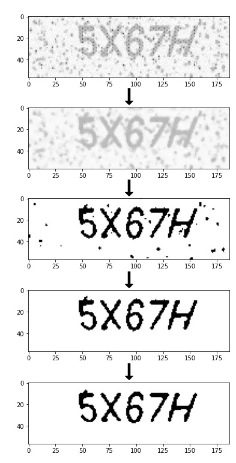

# CAPTCHA Solver


This project provides a Python script for solving CAPTCHAs using image processing techniques and OCR (Optical Character Recognition).

## Description

The CAPTCHA Solver is a tool designed to automate the process of reading and interpreting CAPTCHA images. It uses various image processing techniques to enhance the CAPTCHA image and then applies OCR to extract the text. This tool can be useful for testing purposes or for automating processes that involve CAPTCHAs.

## Features


- Fetches CAPTCHA images from a specified URL
- Applies image preprocessing techniques:
  - Gaussian blur
  - Thresholding
  - Noise removal
  - Contrast enhancement (CLAHE)
  - Bilateral filtering
- Uses Tesseract OCR to extract text from the processed image
- Saves both original and processed CAPTCHA images

## Requirements

- Python 3.x
- requests
- Pillow (PIL)
- pytesseract
- OpenCV (cv2)
- NumPy

## Installation

1. Clone this repository:
   ```
   git clone https://github.com/AKhilRaghav0/captcha-solver.git
   ```
2. Install the required packages:
   ```
   pip install requests Pillow pytesseract opencv-python numpy
   ```
3. Install Tesseract OCR on your system (if not already installed)

## Usage

1. Replace the `<DUMMY_LINK_FOR_YOUR_CAPTCHA_REPLACE_THIS>` in the script with the actual URL of the CAPTCHA image you want to solve.
2. Run the script:
   ```
   python captcha_solver.py
   ```
3. The script will save the original and processed CAPTCHA images and print the extracted text.

## Disclaimer

This tool is for educational and testing purposes only. Make sure you have permission to access and process the CAPTCHAs you're working with. Unauthorized use of this tool to bypass CAPTCHAs on websites you don't own or have permission to test may be illegal.

## Contributing

Contributions, issues, and feature requests are welcome. Feel free to check [issues page](https://github.com/AKhilRaghav0/captcha-solver/issues) if you want to contribute.

## License

[MIT](https://choosealicense.com/licenses/mit/)
